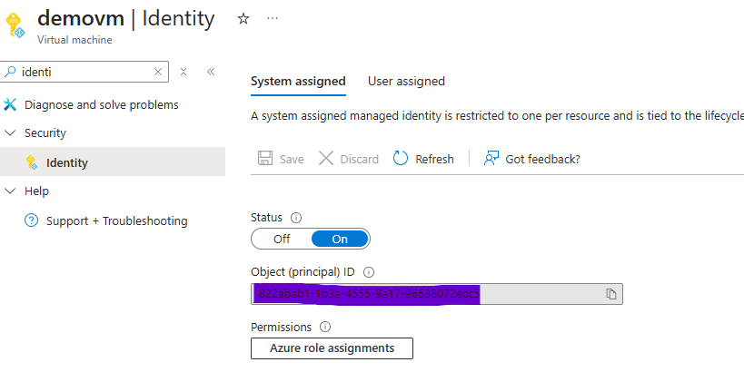
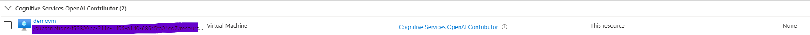
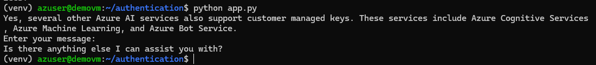

This is sample project to test the azure open ai access with managed identity authentication.

 * Steps:
 * 1. **Set Up Managed Identity**: Ensure that your application is running in an environment that supports managed identities (VM, AKS , App Service etc.,)
 * 2. **Assign Role**: Assign **_Cognitive Services OpenAI User_** or **_Cognitive Services OpenAI Contributor_** role to the managed identity to access the OpenAI service. 
 * 3. **Obtain Access Token**: Use Azure Identity libraries to obtain an access token for the managed identity.
 * 4. **Configure OpenAI Client**: Initialize the OpenAI client with the obtained access token.
 * 5. **Make API Requests**: Use the OpenAI client to make requests to the OpenAI API.
 * 
 * Note: Ensure that the environment has the necessary permissions and configurations to use managed identities.
* Note: Managed identities cannot be tested from local environment. 
 */

**Example: Run the application from VM enabled with managed identity**

1. Enable managed identity in Azure VM

2. Assign this identity with **_Cognitive Services OpenAI Contributor_** role in Open AI service

3. Install required dependencies and run the application code in VM

    